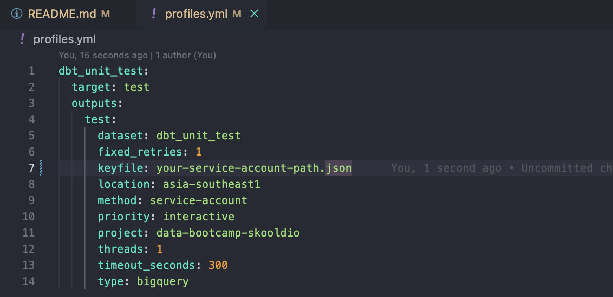

## Getting Started
### Prerequisites

* poetry
  ```sh
  https://python-poetry.org/docs/
  ```

### Installation

1. Clone the repo
   ```sh
   git clone git@github.com:firstnapat/dbt-unit-test-101.git
   ```
2. Install Python package
   ```sh
   poetry install
   ```
3. Install dbt packages
   ```sh
   dbt deps
   ```
4. Setting profiles
    * Get service account from GCP
    * set `keyfile: your-service-account-path.json` in profiles.yml 

   

### Run
1. Load source to BigQuery
   ```sh
   dbt seed
   ```
2. Run Staging model
   ```sh
   dbt run
   ```
2. Test
   ```sh
   dbt test --select tests/unit/staging/
   ```


### Resources:
- Learn more about dbt [in the docs](https://docs.getdbt.com/docs/introduction)
- Check out dbt-unit-test [dbt-unit-test](https://hub.getdbt.com/EqualExperts/dbt_unit_testing/latest/)